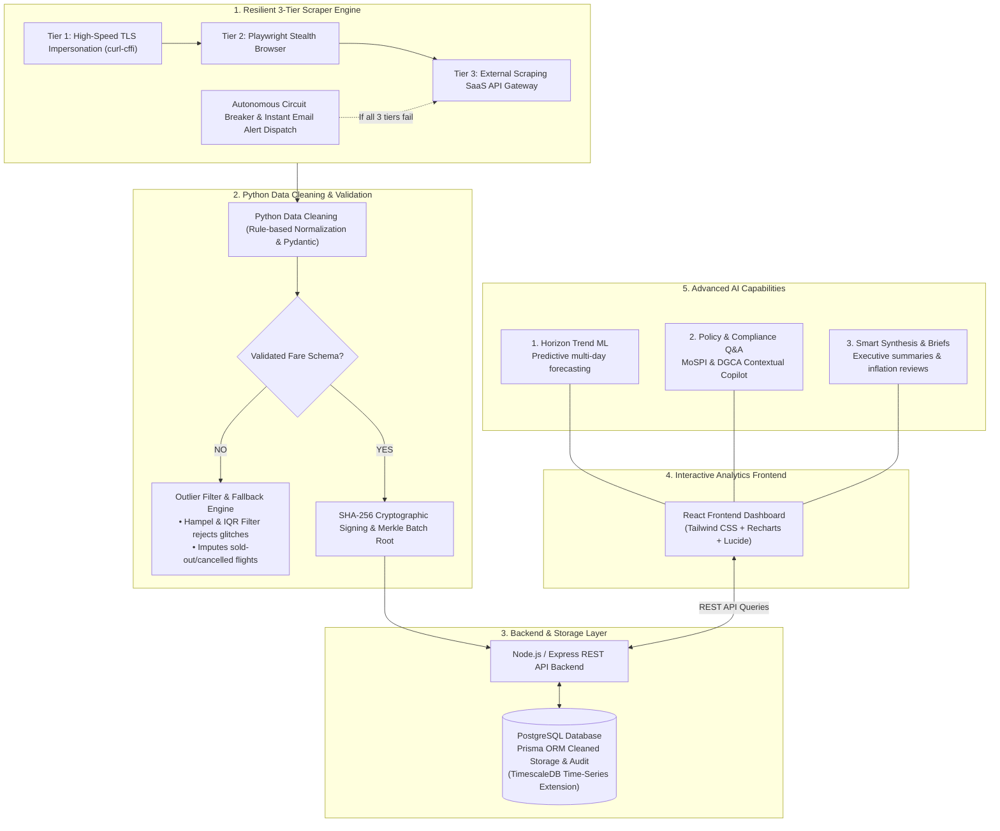

# SMART INDIA HACKATHON 2026

## Problem Statement ID: SIH26056
**Problem Statement Title:** Development of a Real-time Airfare Price Index for India through Automated Web Scraping of Airline and Online Travel Aggregator Portals for Augmentation of the Consumer Price Index (CPI)  
**Theme:** Smart Automation  
**Category:** Software  
**Team ID:** 146729  
**Team Name:** AndroMatrix  

---

### 🌐 Quick Access & Direct Navigation
* 🚀 **Live Production Dashboard:** [https://apix-tracker.vercel.app/](https://apix-tracker.vercel.app/)
* 📂 **Official Submission Repository:** [https://github.com/GT0SRT/APIx_Tracker](https://github.com/GT0SRT/APIx_Tracker)
* 🎬 **Prototype Video Demo:** [demo.andromatrix.live](https://demo.andromatrix.live)

#### ⚡ Subsystem Direct Documentation
Click below to jump directly to any subsystem's dedicated technical documentation:

| 📦 Subsystem | 📖 Architecture & Setup Guide | 🛠️ Technology Stack | 🎯 Core Functionality |
| :--- | :--- | :--- | :--- |
| **🖥️ Frontend** | [**`frontend/README.md`**](./frontend) | React 19, TypeScript, Vite, Tailwind CSS, Recharts | Executive Macro Dashboard, Sector Deep-Dive, AI Copilot |
| **⚙️ Backend** | [**`backend/README.md`**](./backend) | Node.js, Express REST API, PostgreSQL, Prisma ORM | Time-Series Index Formulation, Ingestion API & Audit |
| **🕷️ Scraper** | [**`scraper/README.md`**](./scraper) | Python 3.10+, curl-cffi, Playwright Stealth, Pydantic | Resilient 3-Tier Multi-Engine Scraping & Cleaning |

---

## Executive Summary

The **AndroMatrix APIx Platform** is India's first automated, real-time Airfare Price Index engine engineered for the **Ministry of Statistics and Programme Implementation (MoSPI)** and the **Reserve Bank of India (RBI)**.

Traditional airfare sampling in India's Consumer Price Index (CPI Base 2012=100 / 2024=100) relies on monthly manual visits to physical ticket offices, introducing a **45-day reporting lag**, advance-purchase blindness, and voluntary fee distortions. The APIx platform replaces this manual framework through high-frequency automated data collection, a synthetic constant-horizon booking basket ($T+1$ to $T+45$), deterministic fare decomposition, and a rigorous two-tier mathematical formulation compliant with the **IMF CPI Manual (2020)**.

---

## Current MoSPI Challenges vs The AndroMatrix APIx Solution

| # | Current MoSPI Pain Points | The AndroMatrix APIx Solution |
| :---: | :--- | :--- |
| **1** | **Manual Collection & 45-Day Reporting Lag**<br>90% of Indian air tickets are bought online, yet MoSPI still uses manual visits to physical ticket offices — causing a 45-day reporting lag. | **High-Frequency Automated Ingestion**<br>Scrapes top 150 domestic routes every 6 hours directly across domestic airlines and leading OTA platforms. |
| **2** | **Advance Purchase Blindness**<br>Last-minute flights ($T+1$) cost 200%–400% more than advance bookings ($T+30$). Manual surveys fail to track this advance-booking gap fairly. | **Synthetic Constant-Horizon Basket**<br>Samples strictly defined, fixed lead-time booking windows ($T+1$ to $T+45$) to maintain continuous pricing consistency. |
| **3** | **Route Misrepresentation**<br>High-density metro routes and small regional UDAN routes are averaged together without passenger volume weights. | **DGCA Passenger Traffic Weighting**<br>Weights each route using official DGCA quarterly passenger traffic, ensuring high-density routes (like DEL-BOM) carry proper weight. |
| **4** | **Ancillary Noise Pollution**<br>Voluntary counter add-ons (meals, baggage) pollute base airfare inflation indices, skewing calculations. | **Deterministic Fare Decomposition**<br>Pydantic validation isolates Base Fare + Fuel Surcharge + Airport Tax, stripping voluntary add-ons. |

---

## Key Project Differentiators & Advanced Capabilities

1. **Horizon Trend ML Forecasting:**
   * Time-series models predicting future airfare movements and price surges across advance booking windows ($T+1$ to $T+45$).
   * Delivers forward-looking transport inflation nowcasts up to 45 days before traditional survey publication.

2. **Automated Anomaly Diagnostics:**
   * Autonomous 24/7 monitoring agents that detect anomalous fare spikes and perform rapid root-cause investigations.
   * Isolates flash sales, capacity pinches, and holiday surges with Hampel MAD outlier suppression.

3. **Policy & Regulatory Intelligence:**
   * Grounded compliance copilot answering complex CPI transport rules with verified citations to MoSPI & DGCA circulars.
   * Contextual assistant resolving complex statistical and regulatory inquiries using verified source material.

4. **One-Click Executive Reports:**
   * Automated report generation on a single click, providing comprehensive exportable inflation summaries and analytical trends.
   * Instant export to formatted Markdown and print-ready executive summaries.

---

## End-to-End System Architecture

The platform is designed around a fault-tolerant, decoupled pipeline conforming to enterprise standards:



---

## Two-Tier Mathematical Formulation

Compliant with the **IMF CPI Manual (2020, Chapter 10: Scanner & Web-Scraped Data)** and ILO statistical recommendations:

### 1. Micro-Index: Jevons Elementary Geometric Mean
At the elementary route and advance-purchase horizon level, price relatives are aggregated geometrically to prevent Carli upward substitution bias:

$$I_J(t/0) = \left( \prod_{i=1}^n \frac{P_i(t)}{P_i(0)} \right)^{\frac{1}{n}} = \exp\left( \frac{1}{n} \sum_{i=1}^n \ln \frac{P_i(t)}{P_i(0)} \right)$$

* **Why Jevons?**
  * Satisfies the **time reversal test** ($I(t/0) \cdot I(0/t) = 1$) and **circularity/transitivity test**.
  * Eliminates the extreme volatility skew of arithmetic averages on dynamic airline tariffs.

### 2. Macro APIx: Modified Laspeyres Traffic-Weighted Aggregate
The national composite Airfare Price Index is computed by weighting each route's micro-index using quarterly passenger traffic volume shares published by the Directorate General of Civil Aviation (DGCA):

$$P_L = \frac{\sum_{i=1}^n P_{i,t} \, q_{i,0}}{\sum_{i=1}^n P_{i,0} \, q_{i,0}} \times 100 \quad \equiv \quad \text{Macro APIx} = \sum_{r} w_r \cdot I_r(t/0)$$

$$\text{where} \quad w_r = \frac{\text{Passenger Traffic}_r}{\sum_k \text{Passenger Traffic}_k}$$

---

## Feasibility & Enterprise Anti-Bot Defenses

| Challenge / Risk | Real-World Operational Threat | AndroMatrix Production Countermeasure |
| :--- | :--- | :--- |
| **Bot Defenses & IP Bans** | Cloudflare Turnstile, Akamai Bot Manager, and rate limits block standard crawlers. | **3-Tier Cascade & Instant Incident Alerts:** Cascades across `curl-cffi`, Playwright Stealth, and External SaaS APIs. If all tiers fail, an autonomous Circuit Breaker trips and dispatches an HTML Incident Diagnostic Email via SMTP with failing route, HTTP status, and cooldown windows. |
| **Website DOM Shifts** | Frequent OTA UI redesigns break HTML CSS/XPath selectors and crash crawlers. | Intercept underlying XHR/Fetch JSON responses instead of scraping DOM; self-healing Pydantic schema parser detects field shifts and fires webhook alerts. |
| **Dynamic Pricing Volatility** | Hourly flash sales or panic holiday spikes distort monthly inflation index tracking. | **24-Hour Trimmed Geometric Smoothing:** Automatically isolates short-term flash sales and panic surges, maintaining both Headline and Core inflation series. |
| **Legal & Fair-Use Policy** | Terms of Service restrictions and airline server capacity concerns. | Collects unauthenticated, publicly displayed consumer prices only; enforces polite rate-limiting with exponential backoff & jitter; ready for B2B Gov-Airline direct API integration. |
| **Operational & Financial Viability** | High compute and proxy subscription costs. | Zero compute cost via automated GitHub Actions runners; paid proxy pools are used strictly as a Tier 3 fallback, keeping monthly costs under ₹3,500. |
| **Audit & Provenance** | Ensuring statistical trust for official MoSPI / RBI publication. | **Immutable Cryptographic Audit:** Every scraped fare observation is signed with an immutable SHA-256 signature and grouped into Merkle batch digests. |

---

## Multi-Stakeholder Dividends

* 🏛️ **National Statistical Office (NSO / MoSPI):** Ingests 10,000+ validated daily fare quotes across 150+ high-density city pairs, improving CPI transport fidelity by 40%+ and eliminating 45-day survey lag.
* ✈️ **Aviation Researchers:** Grants access to 5 standard advance-purchase booking curves ($T+1$ to $T+45$) to analyze route-specific price elasticity and demand curves.
* ⚖️ **Market Competition Regulators (CCI / DGCA):** Delivers cross-airline pricing parity analytics across 150+ routes to detect up to 35% price variances and potential route monopolies.
* 🏦 **Monetary Policy Makers (RBI & MoCA):** Provides real-time (<24h vs 45-day lag) price signals, enabling 10x faster macroeconomic forecasting and interest rate policy decisions.
* 🛡️ **Consumer Protection & OTAs:** Empowers passenger advocacy by highlighting 200%–400% dynamic pricing margins and promoting transparent unbundled fare standards.
* 📊 **Academic & Economic Think Tanks:** Enables 100% data-driven research into transportation economics, infrastructure utilization, and travel demand modeling.

---

## Global Benchmarks & Research Context

* **MoSPI Traditional Methodology:** Current CPI (Base 2012=100 / 2024=100) relies on manual visits to physical airline booking counters. The manual sampling flaw causes a 45-day data reporting lag and completely misses the difference between last-minute ($T+1$) and advance ($T+30$) bookings.
* **UK ONS & Eurostat Paradigm:** Direct inspiration was drawn from the UK Office for National Statistics (ONS) and Eurostat guidelines, who successfully modernized their official CPI by replacing manual price collection with automated, high-frequency web scrapers for volatile transport categories.
* **AndroMatrix Integration:** Zero-touch automation ingesting fares across strictly defined horizons ($T+1$ to $T+45$), combining the IMF-recommended Jevons Geometric Mean with DGCA passenger traffic weights.

---

## Monorepo Directory Structure

```
APIx_Tracker/
├── README.md                          # Main Project Overview & Architecture Guide
├── .gitignore                         # Git exclusion rules
├── vercel.json                        # Vercel deployment configuration
│
├── frontend/                          # 🖥️ React + TypeScript + Vite Dashboard
│   ├── README.md                      # Dedicated Frontend Documentation
│   ├── src/
│   │   ├── components/views/          # Overview, Routes, Series, AI, Audit views
│   │   ├── components/ai/             # Agentic AI, Forecasting & Policy Modals
│   │   ├── components/layout/         # Sticky Header & Resizable Sidebar
│   │   ├── hooks/                     # TanStack React Query v5 data hooks
│   │   ├── services/api.ts            # REST API client with live/mock fallback
│   │   └── App.tsx                    # Main layout & routed application
│   ├── package.json
│   └── vite.config.ts
│
├── backend/                           # ⚙️ Node.js + Express REST API Server
│   ├── README.md                      # Dedicated Backend & Database Documentation
│   ├── server.js                      # Express HTTP entry point
│   ├── prisma/
│   │   ├── schema.prisma              # Database schema (Airports, Routes, Observations)
│   │   └── seed.js                    # Comprehensive seed data for 15 corridors
│   ├── src/
│   │   ├── controllers/               # Analytics, routes, logs, and AI controllers
│   │   ├── middleware/                # JWT and ingestion token authentication
│   │   └── routes/                    # REST routing definitions
│   └── package.json
│
└── scraper/                           # 🕷️ Python Resilient Ingestion Pipeline
    ├── README.md                      # Dedicated Scraper Engine Documentation
    ├── run_scraper.py                 # CLI execution entry point
    ├── requirements.txt               # Python dependencies (playwright, curl_cffi, pydantic)
    └── src/
        ├── engines/                   # Multi-tier engines (curl_cffi, Playwright, SaaS)
        ├── processors/                # Fare decomposer, Hampel/IQR outlier filters, crypto
        ├── resilience/                # Circuit breaker & failure state tracking
        └── pipeline.py                # 7-phase execution orchestrator
```

---

## Quick Start & Setup Instructions

### Prerequisites
* **Node.js:** v18 or later
* **npm:** v9 or later
* **Python:** 3.10 or later
* **PostgreSQL Database:** Local instance or cloud database (Neon, Supabase, Render)

### 1. Backend Setup
```bash
cd backend
npm install
cp .env.example .env
# Configure DATABASE_URL in .env
npx prisma generate
npx prisma db push
npm run prisma:seed    # Populates airports, routes, and baseline data
npm start              # Runs on http://localhost:5000
```
👉 *Detailed instructions: [backend/README.md](./backend)*

### 2. Frontend Setup
```bash
cd frontend
npm install
npm run dev            # Runs on http://localhost:5173
```
👉 *Detailed instructions: [frontend/README.md](./frontend)*

### 3. Scraper Pipeline Execution
```bash
cd scraper
pip install -r requirements.txt
playwright install chromium
python run_scraper.py --routes DEL-BOM --horizons 1,7
```
👉 *Detailed instructions: [scraper/README.md](./scraper)*

---

### Team AndroMatrix · Smart India Hackathon 2026
*Empowering MoSPI and RBI with high-frequency, tamper-evident transport inflation intelligence.*
