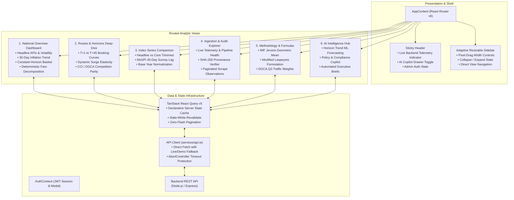

# AndroMatrix APIx - Frontend Analytics Dashboard
### Executive Macroeconomic Transport Inflation Dashboard
**Smart India Hackathon 2026 · Problem Statement SIH26056**  
**Team ID:** 146729 · **Team Name:** AndroMatrix  

---

### 🌐 Quick Navigation
* [🏠 Main Project Documentation](../README.md)
* [⚙️ Backend REST API & Database](../backend)
* [🕷️ Resilient Scraper Engine](../scraper)
* [🚀 Live Production Dashboard](https://apix-tracker.vercel.app/)

---

## Overview

The **APIx Frontend Dashboard** is a high-performance executive analytics web application engineered for officials at the **Ministry of Statistics and Programme Implementation (MoSPI)**, the **Reserve Bank of India (RBI)**, and the **Competition Commission of India (CCI)**.

Built with **React 19, TypeScript, and Vite**, it transforms millions of high-frequency scraped airline price observations into real-time macroeconomic price index trajectories, lead-time elasticity curves, and tamper-evident cryptographic audit logs with sub-second responsiveness.

---

## Frontend Architecture & Component Hierarchy



---

## Core Analytic Views & Capabilities

### 1. National Overview Dashboard (`/`)
* **Headline KPI Metric Cards:** Current National Composite APIx (Base 2024 = 100), Average Base Fare, Dynamic Volatility Rating (with Hampel/IQR suppression active), and Total Validated Quotes.
* **30-Day APIx Inflation Trend Chart:** Tracks daily airfare price movements against baseline anchor across all 150+ monitored domestic flight corridors.
* **Lead-Time Elasticity Basket:** Constant-horizon pricing across discrete advance booking windows ($T+1$ to $T+45$) for benchmark domestic trunk corridors.
* **Deterministic Fare Decomposition:** Interactive donut visualization breaking down gross passenger fares into pure Base Fare, Fuel Surcharge ($YQ$), and Airport Development Fee ($UDF$).
* **Top DGCA Corridors:** Horizontal comparative ranking of high-density trunk routes weighted by passenger volumes.

### 2. Routes, Horizons & Competition Parity (`/routes-horizons`)
* **Sector Selector Dropdown:** Analyzes individual domestic city-pairs (`DEL-BOM`, `DEL-BLR`, `BOM-BLR`, etc.) with their official DGCA traffic volume weights ($w_r$).
* **Advance-Purchase Booking Curves:** Renders stacked bar charts illustrating how fares surge exponentially between $T+45$ (advance booking) and $T+1$ (last-minute emergency travel).
* **CCI & DGCA Competition Parity Table:** Cross-carrier fare surveillance comparing IndiGo ($6E$), Air India ($AI$), and Akasa Air ($QP$) with automatic detection of price spreads and monopolistic warnings.
* **DGCA Traffic Share Matrix:** Displays quarterly passenger traffic volumes and formula weighting contributions.

### 3. Index Series Comparison (`/index-series`)
* **Multi-Series Macro Plotting:** Visualizes three distinct series simultaneously:
  1. **Headline APIx:** Full dynamic unbundled airfare movement.
  2. **Core Trimmed APIx:** 24-hour trimmed geometric smoothing isolating seasonal flash sales and panic surges.
  3. **Official MoSPI Lag:** Simulates the traditional 45-day delayed manual survey to highlight the blindspot of physical price collection.

### 4. Ingestion & Cryptographic Audit (`/audit-logs`)
* **Scraper Telemetry:** Real-time metrics showing ingestion cluster status, active scrapers, quotes processed today, and cryptographic SHA-256 verification rate.
* **Paginated Observations Feed:** Interactive table displaying individual scraped flights with flight numbers, advance windows, unbundled fare decomposition, and immutable SHA-256 fingerprints.

### 5. AI Intelligence Hub (`/ai-intelligence`)
* **Horizon Trend ML Forecasting:** Time-series model outputs predicting dynamic price surges across booking horizons ($T+1$ to $T+45$).
* **Policy & Compliance Copilot:** Grounded conversational assistant answering complex inquiries regarding MoSPI CPI frameworks and DGCA fare regulations with citations.
* **Automated Executive Briefs:** One-click generation of formatted Markdown reports compiling headline inflation metrics, regional variance highlights, and policy notes.

### 6. Methodology & Mathematical Formulas (`/methodology`)
* **Interactive Formula Explanations:** Explains the mathematical derivation of the **Jevons Geometric Mean** ($I_J$) and the **Modified Laspeyres Aggregate** ($P_L$) with dynamic formula sliders and KaTeX mathematical rendering.

---

## Technology Stack & Libraries

| Category | Technology | Usage & Rationale |
| :--- | :--- | :--- |
| **Core Framework** | React 19 + TypeScript | Strict type safety, high rendering performance, declarative components |
| **Build Tool** | Vite 8 | Ultra-fast Hot Module Replacement (HMR) and optimized tree-shaken production bundles |
| **Routing** | React Router v6 | Client-side routing with URL synchronization and role-based redirects |
| **Data Fetching** | TanStack React Query v5 | Declarative server-state caching, background revalidation, and zero-flash pagination |
| **Data Visualization** | Recharts 2 | Responsive, composable SVG charts (Line, Bar, Pie, Stacked Curves) |
| **Styling** | Tailwind CSS v4 | Utility-first responsive design tokens and dark/light adaptive surfaces |
| **Icons** | Lucide React | Modern, lightweight icon system |
| **Mathematical Typesetting** | KaTeX | High-performance LaTeX formula rendering for macroeconomic index formulations |

---

## Setup & Development Guide

### 1. Prerequisites
* **Node.js:** v18.0.0 or later
* **npm:** v9.0.0 or later

### 2. Installation
```bash
cd frontend
npm install
```

### 3. Environment Configuration (`.env`)
Create an optional `.env` file in `frontend/` to point to a custom backend instance:
```env
VITE_API_BASE_URL=http://localhost:5000/api/v1
```
*(If omitted, the frontend automatically defaults to the production Render backend API).*

### 4. Run Development Server
```bash
npm run dev
```
The application opens at `http://localhost:5173`.

### 5. Production Build & Type Check
```bash
npm run build
```
Executes TypeScript compilation (`tsc -b`) and Vite production bundle optimization.

---

### Team AndroMatrix · Smart India Hackathon 2026
*High-performance macroeconomic analytics for the Ministry of Statistics and Programme Implementation.*
