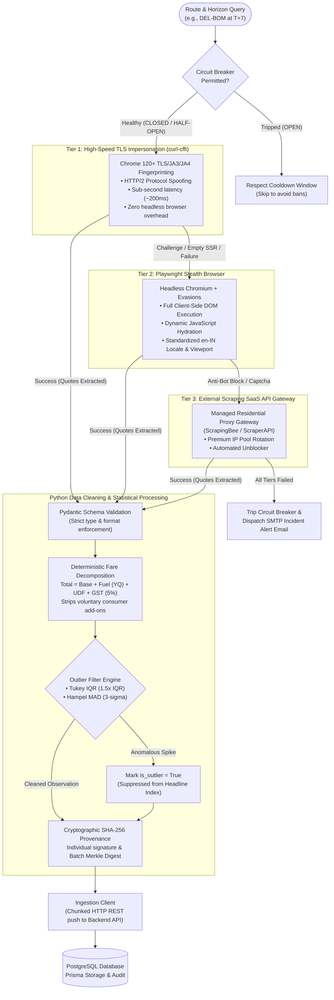

# AndroMatrix APIx Scraper Engine
### Resilient 3-Tier Multi-Engine Ingestion Pipeline
**Smart India Hackathon 2026 · Problem Statement SIH26056**  
**Team ID:** 146729 · **Team Name:** AndroMatrix  

---

### 🌐 Quick Navigation
* [🏠 Main Project Documentation](../README.md)
* [🖥️ Frontend Analytics Dashboard](../frontend)
* [⚙️ Backend REST API & Database](../backend)
* [🚀 Live Production Demo](https://apix-tracker.vercel.app/)

---

## Overview

The **APIx Scraper Engine** is the automated data collection and statistical cleaning subsystem of the AndroMatrix Airfare Price Index platform. Engineered for the **Ministry of Statistics and Programme Implementation (MoSPI)** and the **Reserve Bank of India (RBI)**, it replaces outdated 45-day manual price surveying with high-frequency, tamper-evident automated scraping of domestic scheduled airfares.

---

## Resilient 3-Tier Scraper Architecture

To guarantee 24/7 scraping high availability under enterprise anti-bot defenses (Cloudflare Turnstile, Akamai Bot Manager, rate limits), the engine implements a **cascading 3-Tier multi-engine failover architecture** governed by an autonomous **Circuit Breaker**:



---

## The 3-Tier Multi-Engine Strategy Explained

1. **Tier 1: High-Speed TLS Impersonation (`curl_cffi`)**
   * Employs Chrome 120+ browser TLS signatures, JA3/JA4 fingerprinting, and HTTP/2 spoofing.
   * Delivers sub-second response times without the heavy memory footprint of running browser instances.
   * Ideal for high-frequency queries that do not require complex client-side JavaScript hydration.

2. **Tier 2: Playwright Stealth Browser**
   * Uses headless Chromium fortified with `playwright-stealth` evasions (`navigator.webdriver` suppression, hardware profile spoofing, localized `en-IN` viewports).
   * Fully executes dynamic client-side single-page application (SPA) payloads and waits for live quote hydration.

3. **Tier 3: External Scraping SaaS API Gateway**
   * Commercial residential proxy gateway (ScrapingBee / ScraperAPI) used strictly as a last-resort fallback.
   * Automatically routes queries through rotating residential IPs when severe Cloudflare/Akamai rate limits occur.
   * **Financial Viability:** Because Tier 1 and Tier 2 resolve >95% of queries, Tier 3 usage remains minimal, keeping operational costs under ₹3,500/month.

---

## Fault-Tolerant Circuit Breaker

The scraper integrates a stateful **Circuit Breaker** conforming to enterprise resilience patterns:

| State | Behavior | Transition Trigger |
| :--- | :--- | :--- |
| **`CLOSED`** | Normal operational mode. All traffic routes through the multi-tier cascade. | Tripped to `OPEN` after 3 consecutive tier failures on a carrier/route. |
| **`OPEN`** | Execution blocked for the failing source during the cooldown window (default: 6 hours) to prevent carrier bans and polite crawling violation. | Dispatches automated HTML incident diagnostic email via SMTP; transitions to `HALF_OPEN` after cooldown. |
| **`HALF_OPEN`** | Canary probing mode. Allows a single test request to verify carrier recovery. | Transitions back to `CLOSED` on success, or returns to `OPEN` on failure. |

> **Ephemeral Runner Resilience:** Circuit breaker state is persisted to disk (`data/circuit_breaker_state.json`), enabling state continuity across ephemeral GitHub Actions CI runner executions.

---

## 7-Phase Cleaning & Statistical Pipeline

1. **Phase 1 — Horizon Query Generation:** Generates synthetic horizon dates ($T+1, T+7, T+15, T+30, T+45$) for top DGCA domestic corridors.
2. **Phase 2 — Multi-Tier Scraping:** Cascades through Tier 1 $\rightarrow$ Tier 2 $\rightarrow$ Tier 3 with exponential backoff and jitter ($Wait = \min(max, base \cdot 2^{attempt}) \pm jitter$).
3. **Phase 3 — Pydantic Schema Validation:** Normalizes flight numbers, carrier IATA codes, and timestamps into typed `RawFlightQuote` models.
4. **Phase 4 — Deterministic Fare Decomposition:**
   $$\text{Total Fare} = \text{Base Fare} + \text{Fuel Surcharge (YQ)} + \text{Airport Tax (UDF)} + \text{GST (5\%)}$$
   Strips voluntary consumer ancillary add-ons (meals, seat selection, extra baggage) to isolate pure transport inflation.
5. **Phase 5 — Statistical Outlier Rejection:**
   * **Tukey IQR:** Rejects flash promotions outside $[Q1 - 1.5 \cdot IQR, \; Q3 + 1.5 \cdot IQR]$.
   * **Hampel Filter (MAD):** Median Absolute Deviation suppression ($3\sigma$) for single-flight price spikes.
6. **Phase 6 — Cryptographic SHA-256 Provenance:** Computes an immutable SHA-256 fingerprint for every observation and generates a batch Merkle digest conforming to the National Data Governance Framework (NDGF).
7. **Phase 7 — Chunked Backend Ingestion:** Transmits validated, signed batches in chunks of 200 via `IngestionClient` to the Node.js/Express REST API.

---

## Directory Layout

```
scraper/
├── README.md                      # Comprehensive Scraper Documentation
├── requirements.txt               # Python dependencies
├── run_scraper.py                 # CLI execution entry point
├── pytest.ini                     # Pytest suite configuration
├── data/                          # Local JSON/CSV backups & circuit breaker cache
│   ├── circuit_breaker_state.json # Persistent circuit breaker state
│   ├── observations_latest.json  # Latest validated observation batch
│   └── observations_latest.csv   # Flat CSV export
└── src/
    ├── config.py                  # Route catalog, horizons, fee slabs, and proxy settings
    ├── schemas.py                 # Pydantic schemas (RawFlightQuote, FareObservationSchema)
    ├── pipeline.py                # 7-phase execution orchestrator
    ├── ingestion_client.py        # HTTP REST bridge to Backend API
    ├── cli.py                     # Rich terminal UI & argument parser
    ├── engines/                   # Multi-tier collection engines
    │   ├── base.py                # Base collection engine with backoff & retry
    │   ├── multi_tier.py          # 3-Tier coordinator & failover logic
    │   ├── tier1_curl.py          # Tier 1: curl_cffi TLS impersonation
    │   ├── google_flights.py      # Tier 2: Playwright Stealth browser
    │   └── tier3_api.py           # Tier 3: External Scraping SaaS API
    ├── processors/                # Statistical & cryptographic processors
    │   ├── decomposer.py          # Deterministic Base + Fuel + Tax decomposition
    │   ├── outliers.py            # Tukey IQR & Hampel MAD outlier filters
    │   └── crypto.py              # SHA-256 observation & batch Merkle hashing
    └── resilience/                # Fault tolerance modules
        └── circuit_breaker.py     # Stateful circuit breaker implementation
```

---

## Quick Start & CLI Execution

### 1. Install Dependencies
```bash
cd scraper
pip install -r requirements.txt
playwright install chromium
```

### 2. Configure Environment (`.env`)
```bash
cp .env.example .env
```
Key configuration parameters:
* `BACKEND_API_URL`: Backend REST API URL (`http://localhost:5000` or production Render URL).
* `INGEST_SECRET`: Secret token for authenticated backend transmission.
* `SCRAPER_CONCURRENCY`: Concurrent worker tasks (default: `3`).

### 3. Run Automated Tests
```bash
pytest
```

### 4. Execute Scraper CLI

**Run default 15 demo corridors across core horizons ($T+1, T+7, T+15, T+30, T+45$):**
```bash
python run_scraper.py
```

**Fast single route test (e.g. DEL-BOM on $T+1$ and $T+7$):**
```bash
python run_scraper.py --routes DEL-BOM --horizons 1,7
```

**Run top 5 trunk routes:**
```bash
python run_scraper.py --routes top5 --horizons 1,7,15,30,45
```

**Run full 45-day continuous booking window:**
```bash
python run_scraper.py --routes DEL-BOM --full-45-days
```

**Run without posting to backend (local JSON/CSV export only):**
```bash
python run_scraper.py --routes DEL-BOM --no-ingest
```

---

## Automated 6-Hour Cron via GitHub Actions

The scraper runs autonomously every 6 hours (`0 */6 * * *`) on GitHub's free runners via `.github/workflows/scrape_cron.yml`.

To connect production ingestion:
1. Navigate to **Settings > Secrets and variables > Actions** in your GitHub repository.
2. Add the following secrets:
   * `BACKEND_API_URL`: Your hosted backend endpoint.
   * `INGEST_SECRET`: Your shared ingestion secret token.
3. The workflow executes on schedule and can also be dispatched manually via the **Actions** tab.

---

### Team AndroMatrix · Smart India Hackathon 2026
*High-frequency automated web scraping for the Ministry of Statistics and Programme Implementation (MoSPI).*
